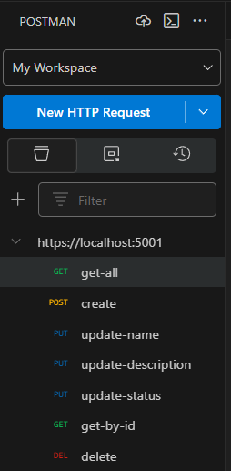
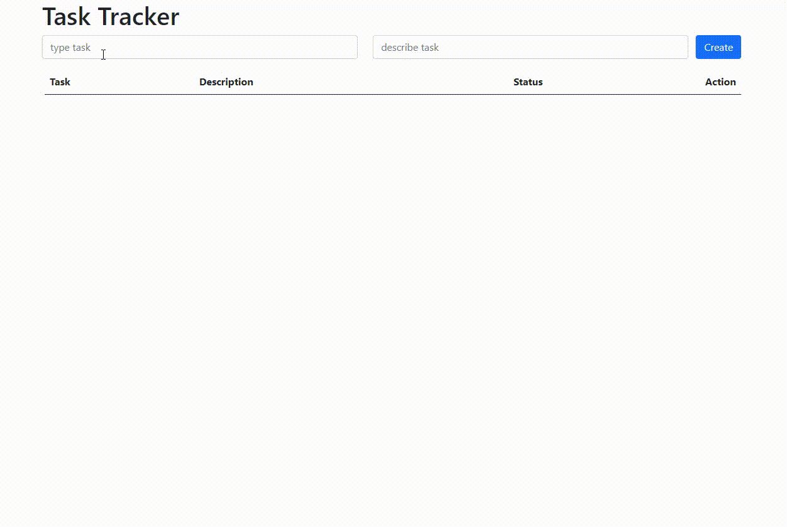

# Task Tracker App

## Used
- IDE: 
    1. `VisualStudio 2022 preview`
    2. `VSCode` (fro front develope)

- core: Asp.NetCore 3.1 (API controllers with static files for map index.html, *.css, *.js). 

- front: Html, Css, Bootstrap, JQuery, Ajax.

- orm: `Microsoft.EntityFrameworkCore` version `3.1.18`

- db: PostgreSQL in docker -> `Npgsql.EntityFrameworkCore.PostgreSQL` version  `3.1.18`

- test: Postman for send requests

## DEMO

